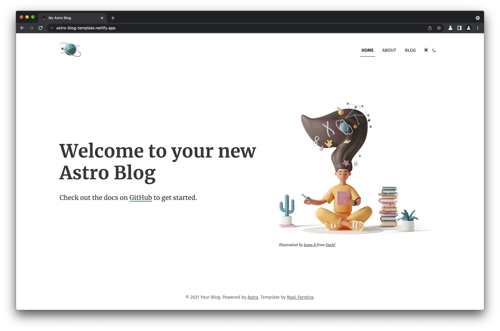

<<<<<<< HEAD
# Astro Starter Kit: Blog

```
npm create astro@latest -- --template blog
```

[](https://stackblitz.com/github/withastro/astro/tree/latest/examples/blog)
[](https://codesandbox.io/p/sandbox/github/withastro/astro/tree/latest/examples/blog)
[](https://codespaces.new/withastro/astro?devcontainer_path=.devcontainer/blog/devcontainer.json)

> 🧑‍🚀 **Seasoned astronaut?** Delete this file. Have fun!


Features:

- ✅ Minimal styling (make it your own!)
- ✅ 100/100 Lighthouse performance
- ✅ SEO-friendly with canonical URLs and OpenGraph data
- ✅ Sitemap support
- ✅ RSS Feed support
- ✅ Markdown & MDX support
=======
# [Astro](https://astro.build) Blog Template

[](https://astro-blog-template.netlify.app/)

## 👉 Check out the ✨ [Live Demo](https://astro-blog-template.netlify.app/) ✨

## 👩‍🚀 Getting Started

### Locally

```
npm init astro -- --template Charca/astro-blog-template
```

### On StackBlitz

[](https://stackblitz.com/github/charca/astro-blog-template)

## ✨ Features:

- ✅ Astro 1.0
- ✅ Dark Mode
- ✅ Full Markdown support
- ✅ SEO-friendly setup with canonical URLs and OpenGraph data
- ✅ RSS 2.0 generation
- ✅ Sitemap.xml generation
>>>>>>> 3cf121b... Initial commit from Astro

## 🚀 Project Structure

Inside of your Astro project, you'll see the following folders and files:

```
<<<<<<< HEAD
├── public/
├── src/
│   ├── components/
│   ├── content/
│   ├── layouts/
│   └── pages/
├── astro.config.mjs
├── README.md
├── package.json
└── tsconfig.json
=======
/
├── public/
│   ├── robots.txt
│   └── favicon.ico
├── src/
│   ├── components/
│   │   └── Tour.astro
│   └── pages/
│       └── index.astro
└── package.json
>>>>>>> 3cf121b... Initial commit from Astro
```

Astro looks for `.astro` or `.md` files in the `src/pages/` directory. Each page is exposed as a route based on its file name.

There's nothing special about `src/components/`, but that's where we like to put any Astro/React/Vue/Svelte/Preact components.

<<<<<<< HEAD
The `src/content/` directory contains "collections" of related Markdown and MDX documents. Use `getCollection()` to retrieve posts from `src/content/blog/`, and type-check your frontmatter using an optional schema. See [Astro's Content Collections docs](https://docs.astro.build/en/guides/content-collections/) to learn more.

=======
>>>>>>> 3cf121b... Initial commit from Astro
Any static assets, like images, can be placed in the `public/` directory.

## 🧞 Commands

All commands are run from the root of the project, from a terminal:

<<<<<<< HEAD
| Command                   | Action                                           |
| :------------------------ | :----------------------------------------------- |
| `npm install`             | Installs dependencies                            |
| `npm run dev`             | Starts local dev server at `localhost:3000`      |
| `npm run build`           | Build your production site to `./dist/`          |
| `npm run preview`         | Preview your build locally, before deploying     |
| `npm run astro ...`       | Run CLI commands like `astro add`, `astro check` |
| `npm run astro -- --help` | Get help using the Astro CLI                     |

## 👀 Want to learn more?

Check out [our documentation](https://docs.astro.build) or jump into our [Discord server](https://astro.build/chat).

## Credit

This theme is based off of the lovely [Bear Blog](https://github.com/HermanMartinus/bearblog/).
=======
| Command           | Action                                       |
| :---------------- | :------------------------------------------- |
| `npm install`     | Installs dependencies                        |
| `npm run dev`     | Starts local dev server at `localhost:3030`  |
| `npm run build`   | Build your production site to `./dist/`      |
| `npm run preview` | Preview your build locally, before deploying |

## 👀 Want to learn more?

Feel free to check [Astro's documentation](https://github.com/withastro/astro) or jump into Astro's [Discord server](https://astro.build/chat).
>>>>>>> 3cf121b... Initial commit from Astro
